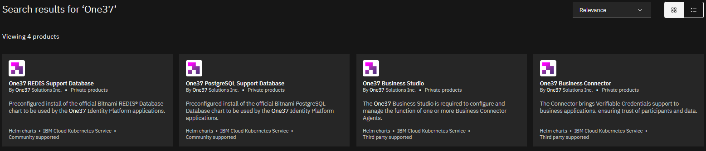

# One37 Helm Catalog for IBM Cloud Catalog

This is the public Helm chart repository for One37 Helm Charts for IBM Cloud Catalog.

These charts represent the latest stable release of the One37 Applications referenced in the IBM Cloud Catalog.

View the available Catalog entries:

[https://cloud.ibm.com/catalog](https://cloud.ibm.com/catalog?search=One37#search_results)



## Prerequisites

* IBM Cloud Account
* A deployed IBM Cloud Kubernetes Service (IKS) cluster with version 1.18 or later
* IBM Cloud CLI configured to use the target cluster
* Helm 3.0 or later

## Pre-Requisite Installation Steps

There a few steps that need to be completed before you can install the One37 Catalog entries to your cluster.

 1. Create a namespace for the One37 Catalog entries
 3. Create a secret to store your One37 Container Registry credentials
 2. Create a secret to store your One37 license key

### Create One37 namespace

Using the IBM Cloud CLI, create a namespace for the One37 Catalog entries

```bash
kubectl create namespace one37id
kubectl config set-context --current --namespace=one37id
```

### Create One37 Container Registry secret

The one37secrets chart is configured to enable you to store your One37 Container Registry credentials. You will be issued these during the registration of your product.

In a working folder in your setup, download the complete chart and it template files.

```bash
helm pull one37id/one37secrets --untar
```

You will be required to edit and provide your own encoded credentials in the `charts/one37secrets/values.yaml` file.


> To generate the encoded `dockerconfigjson` value for a Kubernetes Docker registry secret, you need to follow these steps:
> 1. Generate a base64 encoded `username:password` string, you can use the following command: \
> `echo -n 'username:password' | base64` \
> Remember to replace `username:password` with your actual Docker username and password.
> 2. Create a `config.json` file that contains the Docker registry authentication information. The file should look like this where the `auth` field is the base64 encoded string from the previous step: 

```json
{
  "auths": {
    "https://index.docker.io/v1/": {
      "auth": "dXNlcm5hbWU6cGFzc3dvcmQ="
    }
  }
}
```

> 3. Base64 encode the entire `config.json` file. In a terminal, you can use the following command:

```bash
cat config.json | base64
```

> 4. The output of the above command is the encoded `dockerconfigjson` value that you can use in your Kubernetes Docker registry secret.

Once you have updated the `values.yaml` file, you can install the chart to your cluster.

```bash
helm install one37secrets charts/one37secrets
```

## Install One37 Catalog entries

Once you have completed the pre-requisite steps, you can install the One37 Catalog entries to your cluster.

You can refer to the Installation Guide published on the One37 Documentation website for more details on the installation process.

[https://docs.one37id.com](https://docs.one37id.com/docs/Installation/k8s-ibm-catalog/ibm-intro)

