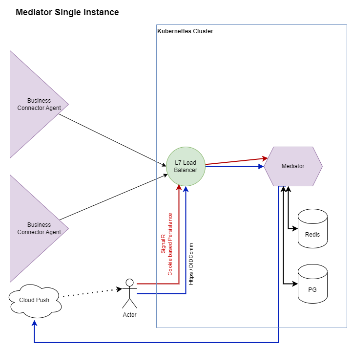
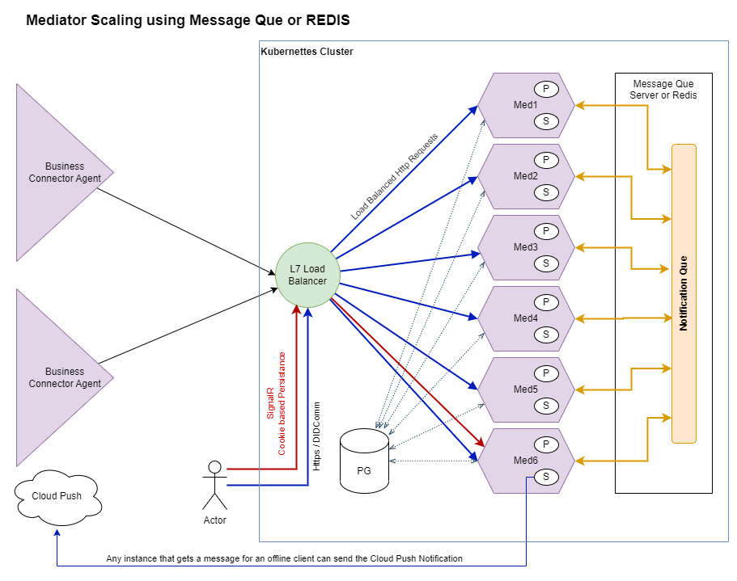

<!--- app-name: one37id-mediator -->

# One37ID Helm Chart for Aries Mediator

The One37 Mediator is an open source, advanced store and forward handler to intermediate between Aries based Agents and connected edge wallets.

## TL;DR

```bash
git clone https://github.com/one37id/charts
cd charts
helm install mediator one37id-mediator
```

## Introduction

This chart bootstraps a [Mediator]() deployment on a [Kubernetes](https://kubernetes.io) cluster using the [Helm](https://helm.sh) package manager.

One37 charts can be used with [Kubeapps](https://kubeapps.dev/) for deployment and management of Helm Charts in clusters.

[Mediator Helm Chart]() will deploy a auto-scalable Mediator.

The main features of the chart are the following:

| Single Instance Mediator                      | Scaled Out Mediator Cluster                           |
|-----------------------------------------------|-------------------------------------------------------|
| Single instance for smaller volume            | Multiple instances for higher processing volume       |
|  |  |


## Prerequisites

- Kubernetes 1.19+
- Helm 3.2.0+
- Pre installed PostgreSQL database and Redis cache. You can use the [One37ID PostgreSQL]() and [One37ID Redis]() charts to deploy them in your cluster.
- [Optional] Kubernetes Ingress Controller up and running in the cluster with optional external load balancer to auto-scalar support.

## Installing the Chart

### From cloned project

To install the chart with the release name `mediator`:

```bash
git clone https://github.com/one37id/charts
cd charts
helm install mediator one37id-mediator
```

The command deploys Mediator on the Kubernetes cluster in the default configuration.
The [Parameters](#parameters) section lists the parameters that can be configured during installation.
These parameters can be edited in the `values.yaml` file before installation.

> **Tip**: List all releases using `helm list`

### From configured Helm Repository

``` bash
# One37 ID Helm Charts
helm repo add helm137 https://fedoraman137.github.io/helm-test
helm repo update
helm install [my-mediator] helm137/one37id-mediator
```

If your users are using a *white labelled* **Upa! App**, you can run your own Mediator Service.

``` bash

```


## Uninstalling the Chart

To uninstall/delete the `mediator` deployment:

```console
helm delete mediator
```

The command removes all the Kubernetes components associated with the chart and deletes the release.

## Parameters

### Global parameters

<!-- TODO - replace with actual params -->

| Name                      | Description                                     | Value |
|---------------------------|-------------------------------------------------|-------|
| `global.imageRegistry`    | Global Docker image registry                    | `""`  |
| `global.imagePullSecrets` | Global Docker registry secret names as an array | `[]`  |
| `global.storageClass`     | Global StorageClass for Persistent Volume(s)    | `""`  |

### Mediator replicas configuration parameters

| Name                   | Description                           | Value |
|------------------------|---------------------------------------|-------|
| `replica.replicaCount` | Number of Mediator replicas to deploy | `3`   |

### Metrics Parameters

The following metrics & instrumentation parameters are only
configurable in the values.yaml `environ` section.

| Name                                  | Description                                             | Value       |
|---------------------------------------|---------------------------------------------------------|-------------|
| `environ.name.OTEL_METRICS_ENABLED`   | Capture Mediator manual Metrics                         | `false`     |
| `environ.name.OTEL_TRACE_ENABLED`     | Capture Mediator Trace instrumentation                  | `false`     |
| `environ.name.OTEL_LOGS_ENABLED`      | Send Mediator Logs to OpenTelemetry                     | `false`     |
| `environ.name.OTEL_ENDPOINT`          | Mediator OpenTelemetry Collector URL                    | `null`      |
| `environ.name.OTEL_PROTOCOL`          | Mediator OpenTelemetry Collector PROTOCOL               | `GRPC/HTTP` |
| `environ.name.OTEL_EXPORT_PROMETHEUS` | Enable local Prometheus Exporter on `/metrics` endpoint | `false`     |

A YAML file that specifies the values for the parameters can be provided while installing the chart. For example,

```console
helm install mediator -f values.yaml one37id-mediator
```

> **Tip**: You can use the default [values.yaml](values.yaml)

## Configuration and installation details

### [Rolling VS Immutable tags](https://docs.bitnami.com/containers/how-to/understand-rolling-tags-containers/)

It is strongly recommended to use immutable tags in a production environment.
This ensures your deployment does not change automatically if the same tag is updated with a different image.

One37 will release a new chart updating its containers if a new version of the main container,
significant changes, or critical vulnerabilities exist.

### Use a different Mediator version

To modify the application version used in this chart, specify a different version of the image
using the `image.tag` parameter and/or a different repository using the `image.repository` parameter.

### Cluster topologies

#### Scaled Instances (Manual or Autoscaled)

When installing the chart with `architecture=scaled`, it will deploy a Mediator StatefulSet with a configurable number of replicas. A single service will be exposed:

#### Default: Standalone

When installing the chart with `architecture=standalone`, it will deploy a standalone Mediator StatefulSet. A single service will be exposed:

- Mediator Master service: Points to the master, where read-write operations can be performed

### Securing traffic using TLS

TLS support can be enabled in the chart by specifying the `tls.` parameters while creating a release. The following parameters should be configured to properly enable the TLS support in the chart:

- `tls.enabled`: Enable TLS support. Defaults to `false`
- `tls.existingSecret`: Name of the secret that contains the certificates. No defaults.
- `tls.certFilename`: Certificate filename. No defaults.
- `tls.certKeyFilename`: Certificate key filename. No defaults.
- `tls.certCAFilename`: CA Certificate filename. No defaults.

Refer to the chart documentation for more information on [creating the secret and a TLS deployment example](https://docs.bitnami.com/kubernetes/infrastructure/Mediatornistration/enable-tls/).

### Metrics

The chart optionally can start a metrics exporter for [prometheus](https://prometheus.io).
The metrics endpoint `/metrics` is exposed in the service.
Metrics can be scraped from within the cluster using something similar as the described in the [example Prometheus scrape configuration](https://github.com/prometheus/prometheus/blob/master/documentation/examples/prometheus-kubernetes.yml).
If metrics are to be scraped from outside the cluster, the Kubernetes API proxy can be utilized to access the endpoint.

## NetworkPolicy

To enable network policy for Mediator, install [a networking plugin that implements the Kubernetes NetworkPolicy spec](https://kubernetes.io/docs/tasks/administer-cluster/declare-network-policy#before-you-begin), and set `networkPolicy.enabled` to `true`.

Refer to the chart documenation for more information on [enabling the network policy in Mediator deployments](https://docs.bitnami.com/kubernetes/infrastructure/Mediatornistration/enable-network-policy/).

## Troubleshooting

Find more information about how to deal with common errors related to One37's Helm charts in [this troubleshooting guide](https://docs.one37id.com/general/how-to/troubleshoot-helm-chart-issues).

## Upgrading

A major chart version change (like v1.2.3 -> v2.0.0) indicates that there is an incompatible breaking change needing manual actions.

## License

Copyright &copy; 2023 One37 Solutions, Inc.

Licensed under the Apache License, Version 2.0 (the "License");
you may not use this file except in compliance with the License.
You may obtain a copy of the License at

<http://www.apache.org/licenses/LICENSE-2.0>

Unless required by applicable law or agreed to in writing, software
distributed under the License is distributed on an "AS IS" BASIS,
WITHOUT WARRANTIES OR CONDITIONS OF ANY KIND, either express or implied.
See the License for the specific language governing permissions and
limitations under the License.